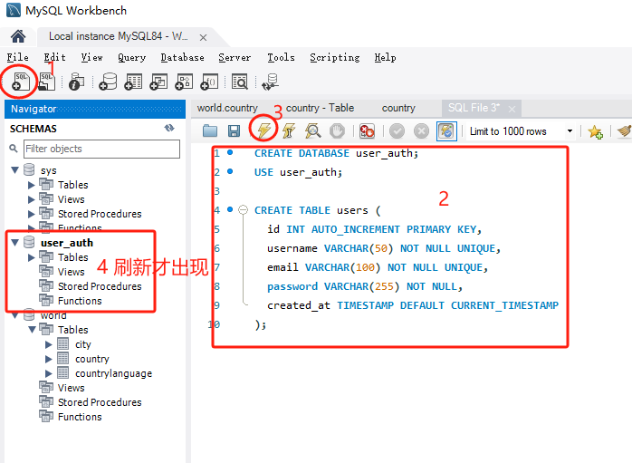

# Node.js + Vue + MySQL 用户注册登录系统

## 项目概述
本项目是一个基于Node.js、Vue CLI和MySQL技术栈开发的用户注册和登录系统。

## 开发流程

### 1. 环境准备

#### 1.1 安装必要软件
- 安装Node.js (推荐v16.x或更高版本)
- 安装MySQL数据库 (推荐v8.0或更高版本)
- 安装Vue CLI
  ```bash
  npm install -g @vue/cli
  ```
- 安装数据库管理工具(可选): MySQL Workbench, Navicat等

#### 1.2 验证安装
```bash
node -v
npm -v
vue --version
mysql --version
```

### 2. 项目初始化

#### 2.1 创建后端项目
```bash
# 创建后端项目目录
mkdir server
cd server

# 初始化package.json
npm init -y
# npm init -y 是 Node.js 包管理工具（npm）的初始化命令，用于快速生成一个默认的 package.json 文件。
# ​**npm init** 是核心命令，表示初始化一个 Node.js 项目，生成项目配置文件 package.json。
# ​**-y 参数** 是 --yes 的简写，表示跳过交互式问答环节，直接采用默认配置生成文件。

# 安装必要依赖
npm install express mysql2 cors dotenv bcrypt jsonwebtoken nodemon --save
```

#### 2.2 创建前端项目
```bash
# 先返回根目录下（不要在当前的server目录下）
cd ..
# 使用Vue CLI创建前端项目
vue create client

# 选择Vue 3配置
# 进入前端项目目录
cd client

# 安装必要依赖
npm install axios vue-router vuex element-plus --save
```

### 3. 数据库设计与配置

#### 3.1 创建数据库
```sql
CREATE DATABASE user_auth;
USE user_auth;

CREATE TABLE users (
  id INT AUTO_INCREMENT PRIMARY KEY,
  username VARCHAR(50) NOT NULL UNIQUE,
  email VARCHAR(100) NOT NULL UNIQUE,
  password VARCHAR(255) NOT NULL,
  created_at TIMESTAMP DEFAULT CURRENT_TIMESTAMP
);
```
示意图：


#### 3.2 配置数据库连接
在server目录下创建.env文件，配置以下数据库连接信息：
- 数据库主机地址
- 数据库用户名
- 数据库密码
- 数据库名称
- JWT密钥
- 服务器端口

### 4. 后端开发

#### 4.1 创建Express服务器
创建server/index.js作为入口文件，实现以下功能：
- 导入必要的依赖（express、cors、dotenv）
- 加载环境变量配置
- 设置中间件（CORS、JSON解析）
- 配置API路由
- 启动HTTP服务器并监听指定端口

#### 4.2 创建数据库连接
创建server/config/db.js文件，实现以下功能：
- 使用mysql2/promise模块创建数据库连接池
- 从环境变量中读取数据库配置信息
- 设置连接池参数（等待连接、连接限制、队列限制等）
- 导出连接池供其他模块使用

#### 4.3 实现用户认证路由
创建server/routes/auth.js文件，实现以下功能：

**注册路由 `/register`**
- 接收用户名、邮箱和密码
- 验证输入字段完整性
- 检查用户名和邮箱是否已存在
- 使用bcrypt加密密码
- 将新用户信息存入数据库
- 生成JWT令牌并返回给客户端

**登录路由 `/login`**
- 接收用户名和密码
- 验证输入字段完整性
- 查找用户并验证密码
- 生成JWT令牌并返回给客户端

**获取用户信息路由 `/me`**
- 验证请求头中的令牌
- 解析令牌获取用户ID
- 查询并返回用户信息

### 5. 前端开发

#### 5.1 配置Vue Router
创建client/src/router/index.js文件，实现以下功能：
- 导入所需的视图组件（Home、Register、Login、Dashboard）
- 配置路由映射表，包括：
  - 首页路由 (`/`)
  - 注册页面路由 (`/register`)
  - 登录页面路由 (`/login`)
  - 控制面板路由 (`/dashboard`，需要身份验证)
- 创建路由实例并配置历史模式
- 实现导航守卫，保护需要身份验证的路由

##### 5.1.1 Vue Router工作原理
Vue Router是Vue.js官方的路由管理器，它的工作原理如下：

1. **路由映射**：将URL路径映射到对应的视图组件
   - 例如：当用户访问`/register`时，显示Register.vue组件
   - 这种映射在router/index.js文件中通过routes数组配置

2. **路由模式**：
   - **Hash模式**：使用URL的哈希部分（如`/#/register`）来模拟完整URL
   - **History模式**：使用HTML5 History API实现URL变化而无需刷新页面（如`/register`）
   - 本项目使用History模式，提供更美观的URL

3. **路由导航**：
   - **声明式导航**：使用`<router-link>`组件创建导航链接
   - **编程式导航**：使用`router.push()`方法在JavaScript代码中实现导航

4. **路由视图**：
   - 使用`<router-view>`组件作为路由组件的渲染出口
   - 当路由变化时，匹配的组件会渲染在`<router-view>`位置

5. **导航守卫**：
   - 用于控制导航的访问权限
   - 例如：`beforeEach`守卫可以检查用户是否已登录，未登录时重定向到登录页面

#### 5.2 配置Vuex Store
创建client/src/store/index.js文件，实现以下功能：
- 定义状态管理：
  - 存储用户令牌、用户信息和认证状态
  - 从localStorage中恢复持久化的数据
- 实现getter方法：
  - 判断用户是否已认证
  - 获取认证状态和用户信息
- 实现mutations：
  - 处理认证请求状态变更
  - 处理认证成功和失败状态
  - 处理登出操作
- 实现actions：
  - 注册功能：发送注册请求、存储令牌和用户信息
  - 登录功能：发送登录请求、存储令牌和用户信息
  - 登出功能：清除令牌和用户信息

#### 5.3 创建视图组件

##### 5.3.1 Home.vue
创建首页组件，实现以下功能：
- 显示欢迎信息和操作按钮
- 根据用户认证状态显示不同的按钮：
  - 未登录用户：显示注册和登录按钮
  - 已登录用户：显示进入控制面板按钮
- 使用Vue 3 Composition API实现组件逻辑
- 添加样式美化界面

##### 5.3.2 Register.vue
创建注册页面组件，实现以下功能：
- 提供用户注册表单，包含以下字段：
  - 用户名输入框
  - 邮箱输入框
  - 密码输入框
  - 确认密码输入框
- 表单验证功能：
  - 验证所有字段是否已填写
  - 验证密码和确认密码是否匹配
  - 显示错误信息
- 提交表单时：
  - 调用Vuex store的register action
  - 显示加载状态
  - 注册成功后重定向到控制面板
- 提供登录页面链接
- 使用Vue 3 Composition API实现组件逻辑
- 添加样式美化界面

##### 5.3.3 Login.vue
创建登录页面组件，实现以下功能：
- 提供用户登录表单，包含以下字段：
  - 用户名输入框
  - 密码输入框
- 表单验证功能：
  - 验证所有字段是否已填写
  - 显示错误信息
- 提交表单时：
  - 调用Vuex store的login action
  - 显示加载状态
  - 登录成功后重定向到控制面板
- 提供注册页面链接
- 使用Vue 3 Composition API实现组件逻辑
- 添加样式美化界面

##### 5.3.4 Dashboard.vue
创建控制面板组件，实现以下功能：
- 显示用户控制面板标题
- 显示用户信息区域：
  - 欢迎信息，显示用户名
  - 显示用户邮箱
- 提供退出登录按钮
- 退出登录功能：
  - 调用Vuex store的logout action
  - 重定向到登录页面
- 使用Vue 3 Composition API实现组件逻辑
- 添加样式美化界面

#### 5.4 配置主应用文件

##### 5.4.1 配置main.js
- 导入必要的依赖和组件
- 配置axios默认请求头，添加认证令牌
- 创建Vue应用实例
- 注册路由、状态管理和UI组件库
- 挂载应用到DOM

##### 5.4.2 配置App.vue
- 创建应用根组件，包含以下部分：
  - 导航栏：显示应用标题和导航链接
  - 根据用户认证状态显示不同的导航选项
  - 主内容区域：渲染当前路由对应的组件
  - 页脚：显示版权信息
- 实现登出功能
- 添加全局样式和布局

### 6. 项目测试与部署

#### 6.1 启动后端服务
1. **打开终端**：在Windows系统中，可以按下`Win+R`键，输入`cmd`并按回车打开命令提示符窗口。

2. **进入server目录**：使用cd命令导航到项目的server目录。
   ```bash
   # 假设你的项目在E盘的project/demo3.7目录下
   cd /d E:\project\demo3.7\server
   ```

3. **安装依赖**：如果是第一次运行，需要安装所有依赖包。
   ```bash
   npm install
   ```

4. **配置环境变量**：确保.env文件已正确配置。
   - 打开server目录下的.env文件
   - 检查并修改以下配置：
     ```
     DB_HOST=localhost        # 数据库主机地址
     DB_USER=root             # 数据库用户名
     DB_PASSWORD=yourpassword # 数据库密码（修改为你的实际密码）
     DB_NAME=user_auth        # 数据库名称
     JWT_SECRET=your_jwt_secret_key # JWT密钥（可以设置为任意复杂字符串）
     PORT=3000                # 服务器端口
     ```

5. **启动Express服务器**：使用以下命令启动后端服务（sever目录下）。
   ```bash
   # 使用nodemon启动（开发模式，自动重启）
   npm run dev
   
   # 或者使用node启动（生产模式）
   npm start
   ```

6. **验证服务器是否成功启动**：
   - 终端应显示：`服务器已在端口 3000 上启动`
   - 这表示后端服务已成功运行在3000端口上

7. **验证API端点**：可以使用浏览器或Postman测试API端点。
   - 例如，访问 `http://localhost:3000/api/auth` 应该会收到响应

#### 6.2 启动前端应用
1. **打开新的终端窗口**：保持后端服务运行，再打开一个新的命令提示符窗口。

2. **进入client目录**：
   ```bash
   cd /d E:\project\demo3.7\client
   ```

3. **安装依赖**：如果是第一次运行，需要安装所有依赖包。
   ```bash
   npm install
   ```
   <!-- 8 vulnerabilities (4 moderate, 4 high)
   终端显示的是npm安装依赖后的审计结果，显示有8个安全漏洞（4个中等级别，4个高级别）。这些是依赖包中的已知安全问题，但不会阻止项目运行。 -->

4. **启动Vue开发服务器**：
   ```bash
   npm run serve
   # 或者使用别名
   npm run dev
   ```
   <!-- 关于项目启动，是的，这种前后端分离的项目架构需要分别启动前端和后端服务。后端服务(Node.js/Express)负责提供API接口和数据库交互，前端服务(Vue)负责提供用户界面。两者通过HTTP请求进行通信。启动顺序通常是先启动后端服务，再启动前端服务。您可以使用工具如concurrently来创建一个命令同时启动两个服务，简化操作流程。 -->

5. **等待编译完成**：终端会显示编译进度，完成后会显示：
   ```
   App running at:
   - Local:   http://localhost:8080/
   - Network: http://192.168.x.x:8080/
   ```

6. **在浏览器中访问应用**：
   - 打开浏览器（Chrome、Edge、Firefox等）
   - 在地址栏输入：`http://localhost:8080`
   - 按回车键访问
   - 你应该能看到应用的首页界面，显示Vue的logo和欢迎信息

#### 6.3 功能测试

##### 6.3.1 首页导航测试
1. **访问首页**：
   - 在浏览器中访问 `http://localhost:8080`
   - 对应文件：`client/src/views/Home.vue`
   - 你将看到应用的首页，包含欢迎信息和导航按钮
   - 首页上应该有两个主要按钮："注册"和"登录"

##### 6.3.2 测试用户注册功能
1. **进入注册页面**：
   - 在首页上，点击导航栏或主内容区域中的"注册"按钮
   - 对应文件：`client/src/views/Register.vue`
   - 浏览器URL将变为：`http://localhost:8080/register`
   - 你将看到一个包含用户名、邮箱、密码和确认密码字段的表单

2. **填写注册表单**：
   - 在用户名字段中输入一个唯一的用户名（例如：`testuser1`）
   - 在邮箱字段中输入一个有效的邮箱地址（例如：`testuser1@example.com`）
   - 在密码字段中输入密码（例如：`password123`）
   - 在确认密码字段中再次输入相同的密码
   - 这些输入字段的验证逻辑在 `Register.vue` 文件中实现

3. **提交注册表单**：
   - 点击表单底部的"注册"按钮
   - 这将触发 `Register.vue` 中的提交处理函数
   - 该函数会调用 `client/src/store/index.js` 中的 `register` action
   - Action会向后端API（`http://localhost:3000/api/auth/register`）发送POST请求
   - 后端处理在 `server/routes/auth.js` 的 `/register` 路由中实现

4. **注册成功后的跳转**：
   - 如果注册成功，系统会自动将你重定向到控制面板页面
   - 对应文件：`client/src/views/Dashboard.vue`
   - 浏览器URL将变为：`http://localhost:8080/dashboard`
   - 重定向逻辑在 `Register.vue` 组件和 Vuex store 的 `register` action 中实现

5. **错误处理**：
   - 如果用户名已存在，系统会显示错误消息："用户名已被使用"
   - 如果邮箱已存在，系统会显示错误消息："邮箱已被注册"
   - 错误消息显示逻辑在 `Register.vue` 组件中实现

##### 6.3.3 测试用户登录功能
1. **进入登录页面**：
   - 在首页上，点击导航栏或主内容区域中的"登录"按钮
   - 对应文件：`client/src/views/Login.vue`
   - 浏览器URL将变为：`http://localhost:8080/login`
   - 你将看到一个包含用户名和密码字段的表单

2. **填写登录表单**：
   - 在用户名字段中输入已注册的用户名（例如：`testuser1`）
   - 在密码字段中输入对应的密码（例如：`password123`）
   - 这些输入字段的验证逻辑在 `Login.vue` 文件中实现

3. **提交登录表单**：
   - 点击表单底部的"登录"按钮
   - 这将触发 `Login.vue` 中的提交处理函数
   - 该函数会调用 `client/src/store/index.js` 中的 `login` action
   - Action会向后端API（`http://localhost:3000/api/auth/login`）发送POST请求
   - 后端处理在 `server/routes/auth.js` 的 `/login` 路由中实现

4. **登录成功后的跳转**：
   - 如果登录成功，系统会自动将你重定向到控制面板页面
   - 对应文件：`client/src/views/Dashboard.vue`
   - 浏览器URL将变为：`http://localhost:8080/dashboard`
   - 重定向逻辑在 `Login.vue` 组件和 Vuex store 的 `login` action 中实现

5. **错误处理**：
   - 如果用户名不存在，系统会显示错误消息："用户不存在"
   - 如果密码错误，系统会显示错误消息："密码错误"
   - 错误消息显示逻辑在 `Login.vue` 组件中实现

##### 6.3.4 测试用户信息获取功能
1. **查看控制面板**：
   - 登录成功后，你将被重定向到控制面板页面
   - 对应文件：`client/src/views/Dashboard.vue`
   - 浏览器URL将为：`http://localhost:8080/dashboard`

2. **验证用户信息显示**：
   - 控制面板应显示欢迎信息，例如："欢迎回来，testuser1"
   - 控制面板应显示用户的邮箱地址
   - 这些信息的获取逻辑在 `Dashboard.vue` 组件中实现
   - 组件会调用 Vuex store 中的 getter 方法获取用户信息
   - 用户信息最初是通过登录或注册时的API响应存储在Vuex中的

3. **API调用验证**：
   - 控制面板加载时，会向后端API（`http://localhost:3000/api/auth/me`）发送GET请求
   - 请求中包含JWT令牌，用于验证用户身份
   - 后端处理在 `server/routes/auth.js` 的 `/me` 路由中实现
   - 这确保显示的是最新的用户信息

##### 6.3.5 测试路由保护功能
1. **未登录访问受保护路由**：
   - 先确保你已登出系统（如果已登录）
   - 在浏览器地址栏直接输入：`http://localhost:8080/dashboard`
   - 按回车键访问

2. **观察重定向行为**：
   - 系统应自动将你重定向到登录页面
   - 浏览器URL将变为：`http://localhost:8080/login`
   - 可能会显示一条消息："请先登录以访问此页面"
   - 这个路由保护逻辑在 `client/src/router/index.js` 文件中实现
   - 具体是通过路由的 `beforeEnter` 守卫或全局 `beforeEach` 守卫实现的

3. **登出后再次测试**：
   - 先登录系统
   - 进入控制面板后，点击"登出"按钮
   - 登出功能在 `Dashboard.vue` 组件中实现，调用 Vuex store 的 `logout` action
   - 登出后，尝试通过地址栏直接访问：`http://localhost:8080/dashboard`
   - 系统应再次将你重定向到登录页面

#### 6.4 部署准备

1. **前端构建优化**：
   - 在client目录下运行生产环境构建命令：
   ```bash
   npm run build
   ```
   - 这将在client/dist目录下生成优化后的静态文件
   - 构建过程会自动压缩代码、优化资源，提高应用性能

2. **后端环境配置**：
   - 确保生产环境的.env文件正确配置：
   ```
   DB_HOST=生产环境数据库地址
   DB_USER=生产环境数据库用户名
   DB_PASSWORD=生产环境数据库密码
   DB_NAME=user_auth
   JWT_SECRET=生产环境密钥（使用复杂的随机字符串）
   PORT=3000
   ```
   - 确保生产环境中已安装所有必要的依赖：
   ```bash
   npm install --production
   ```

3. **数据库备份策略**：
   - 定期备份数据库，可以使用以下命令（在MySQL安装目录的bin文件夹下执行）：
   ```bash
   mysqldump -u root -p user_auth > backup_filename.sql
   ```
   - 系统会提示输入MySQL密码
   - 备份文件将保存在当前目录下
   - 建议设置定时任务，每天自动执行备份

#### 6.5 部署选项

1. **传统服务器部署**：
   - 准备一台安装了Node.js和MySQL的服务器
   - 将前端构建文件（client/dist目录）上传到Web服务器（如Nginx、Apache）的静态文件目录
   - 配置Web服务器将API请求转发到Node.js后端
   - 将后端代码上传到服务器，并使用PM2等工具启动：
   ```bash
   # 安装PM2
   npm install -g pm2
   
   # 使用PM2启动后端服务
   pm2 start index.js --name "user-auth-api"
   ```

2. **容器化部署**：
   - 为前端和后端分别创建Dockerfile
   - 使用Docker Compose编排服务（包括MySQL）
   - 构建并启动容器：
   ```bash
   docker-compose up -d
   ```
   - 容器化部署便于环境一致性和快速部署

3. **云服务部署**：
   - 前端可部署在静态网站托管服务上（如Netlify、Vercel）
   - 后端可部署在云服务提供商的应用服务上（如AWS Elastic Beanstalk、Azure App Service）
   - 数据库可使用云数据库服务（如AWS RDS、Azure Database for MySQL）
   - 按照云服务提供商的具体文档进行部署配置